# SSMSCustomExtension_VSIX
This repository provides VSIX files for installing SSMS Custom Extensions.

By installing this extension, you can use the following features in SSMS.

1. Resource Quick Panel
2. Warning Detection
3. Transaction Isolation Level Auto / Manual Insert
4. Connection Information Overlay
5. Add a statement to verify query information
6. Query Chart Panel

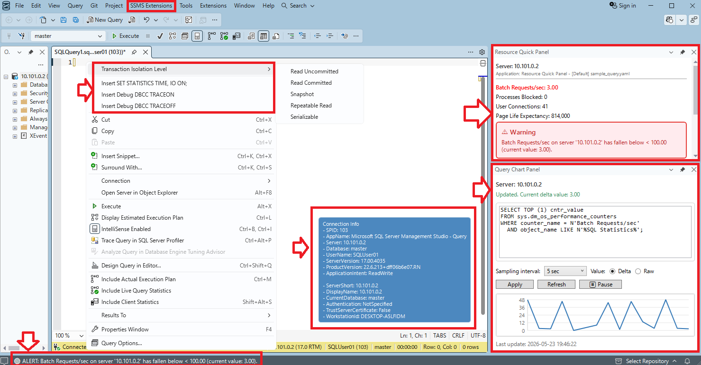


# Installation Instructions
## Prerequisites
This extension has been tested and confirmed to work with the following versions.
- Windows 11 or Windows Server 2025
- SQL Server Management Studio 22.x

## 1. Download VSIX Files
Download the vsix.zip file from the “Releases” section and extract it to the device where you want to install it.
This procedure assumes that the files have been extracted to `C:\vsix`.

## 2. Running the installation script
Run the following script.
```
$vsixPath = "C:\vsix"

$VsixInstaller = "C:\Program Files\Microsoft SQL Server Management Studio 22\Release\Common7\IDE\VSIXInstaller.exe"
$ssmsExePath = "C:\Program Files\Microsoft SQL Server Management Studio 22\Release\Common7\IDE\Ssms.exe"
$ssmsVersion = (Get-Item -LiteralPath $ssmsExePath).VersionInfo.ProductVersion

$installFiles = @(  "CommonOptionsWindow.vsix", 
                    "IsolationLevelAutoInsert.vsix", 
                    "PerformanceResourceQuickPanel.vsix", 
                    "QueryChartPanel.vsix", 
                    "QueryEditorConnectionOverlay.vsix", 
                    "QueryEditorContextMenuExtensions.vsix", 
                    "WarningStatementDetector.vsix")

foreach ($file in $installFiles) {
    $vsixFile = Join-Path -Path $vsixPath -ChildPath $file

    Write-Host "Installing: $vsixFile"

    $process = Start-Process `
        -FilePath $VsixInstaller `
        -ArgumentList @(
            "/quiet",
            "/skuName:Ssms",
            "/skuVersion:$ssmsVersion",
            "`"$vsixFile`""
        ) `
        -Wait `
        -PassThru

    if ($process.ExitCode -ne 0) {
        throw "VSIX install failed. File=$vsixFile ExitCode=$($process.ExitCode)"
    }
}
```

Once the installation is complete, the extension will be deployed to `$env:LOCALAPPDATA\Microsoft\SSMS\22.0_xxxxxxxx\Extensions`.

The script above is deployed to the user profile, but if you have administrator privileges,
you can also deploy it to all users by placing it in `C:\Program Files\Microsoft SQL Server Management Studio 22\Release\Common7\IDE\Extensions`.

## 3. Settings for displaying the menu
This extension adds a dedicated menu.
After installation, follow these steps to add the menu.

1. Launch SSMS
2. [extensions] - [Customize Menu]
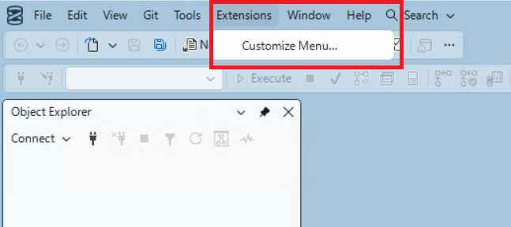
3. Uncheck [SSMS Extensions] in the [Extensions Menu], then click [Save and Restart]
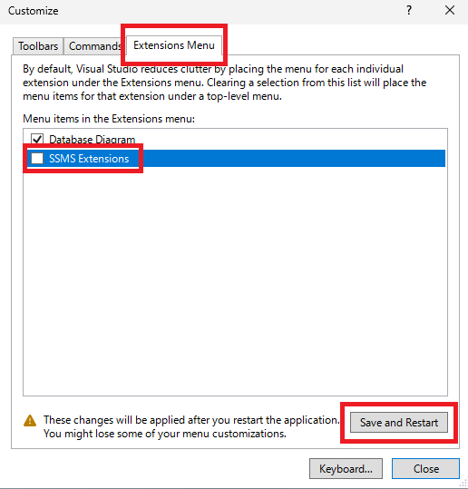

When SSMS restarts, SSMS Extensions will appear as a separate menu.
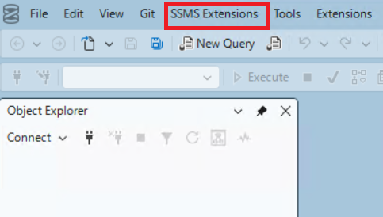

You can change the settings for this extension from this menu.
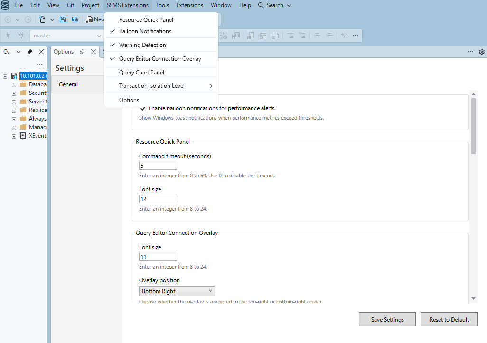

# Features available in this extension
This extension includes the following features.

1. Resource Quick Panel
2. Warning Detection
3. Transaction Isolation Level Auto / Manual Insert
4. Connection Information Overlay
5. Add a statement to verify query information
6. Query Chart Panel

## Resource Quick Panel

You can display the window by clicking “Resource Quick Panel” in the menu.  
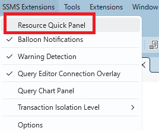

It runs queries on a regular basis and displays the results in the panel.  
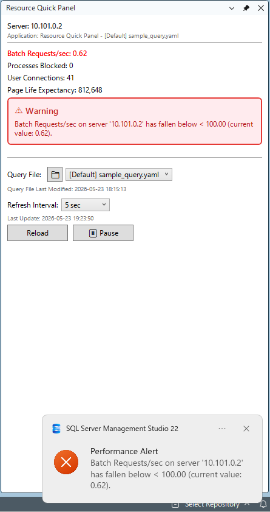

If the threshold is exceeded, a warning can also be displayed using a balloon tip.

The settings are defined in a YAML file, and you can add definitions to `$ENV:LOCALAPPDATA\SSMSCustomExtension\Query`.

By default, the following YAML is included as a sample.
```
# SQL Query Definition File
# 
# ============================================================================
# Basic Syntax
# ============================================================================
#
# description: "Query description"
# query: |
#   SELECT 
#       column1 AS Metric1,
#       column2 AS Metric2
#   FROM table_name;
# metrics:
#   - label: "Metric 1"
#     calculationType: "Raw"
#     displayFormat: "numeric"  # default. Use "text" to show string values
#   - label: "Metric 2"
#     calculationType: "DeltaPerSecond"
#     alert:
#       threshold: 100
#       operator: ">"
#       message: "Alert message with {serverName}, {value}, {threshold}, {operator}"
#
# Example text metric:
#   - label: "Primary Replica"
#     calculationType: "Raw"
#     displayFormat: "text"
#
# ============================================================================
# Available placeholders for use in messages:
#   {serverName} - Server name
#   {value} - Metric value
#   {threshold} - Threshold value
#   {operator} - Comparison operator (>, >=, <, <=, ==, !=)
#
# Available values for calculationType:
#   Raw - Display the raw value as-is
#   DeltaPerSecond - Calculate the difference from the previous value divided by the time interval

description: "Retrieve concurrency metrics from SQL Server performance counters"
query: |
  SELECT 
    (SELECT cntr_value FROM sys.dm_os_performance_counters WHERE counter_name = 'Batch Requests/sec') AS BatchRequestsPerSec
    , (SELECT cntr_value FROM sys.dm_os_performance_counters WHERE counter_name = 'Processes blocked') AS ProcessesBlocked
    , (SELECT cntr_value FROM sys.dm_os_performance_counters WHERE counter_name = 'User Connections') AS UserConnections
    , (SELECT cntr_value FROM sys.dm_os_performance_counters WHERE counter_name = 'Page life expectancy' AND object_name LIKE '%Buffer Manager%') AS PageLifeExpectancy
metrics:
  - label: "Batch Requests/sec"
    calculationType: "DeltaPerSecond"
    displayFormat: "numeric"
    alert:
      threshold: 100
      operator: "<"
      message: "Batch Requests/sec on server '{serverName}' has fallen below {operator} {threshold} (current value: {value})."
  - label: "Processes Blocked"
    calculationType: "Raw"
    alert:
      threshold: 0
      operator: ">"
      message: "{value} process(es) are blocked on server '{serverName}' (threshold:  {operator} {threshold}). Please check the blocking status."
  - label: "User Connections"
    calculationType: "Raw"
  - label: "Page Life Expectancy"
    calculationType: "Raw"
    alert:
      threshold: 300
      operator: "<"
      message: "Page Life Expectancy on server '{serverName}' has fallen below  {operator} {threshold} (current value: {value}). This may indicate memory pressure."
```

## Warning Detection
If a query in the query editor contains `DROP TABLE` or `TRUNCATE TABLE`, a warning will be displayed.

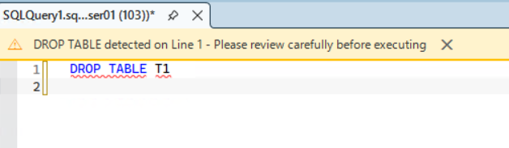

## Transaction Isolation Level Auto / Manual Insert
Inserts the specified transaction isolation level into the first line of the currently displayed query editor.

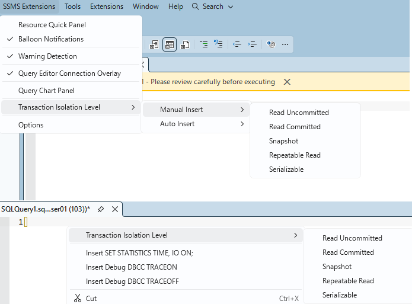

## Connection Information Overlay
Displays information about the SQL Server to connect to in the Query Editor.
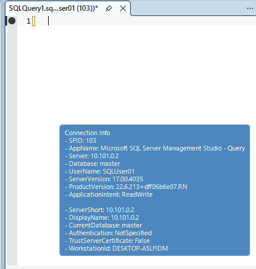

## Add a statement to verify query information
Insert the DBCC statements “SET STATISTICS TIME, IO ON” into the query editor.
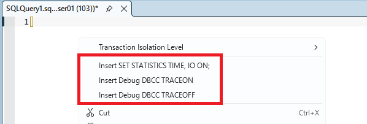

## Query Chart Panel
Run queries periodically and display a line graph.  
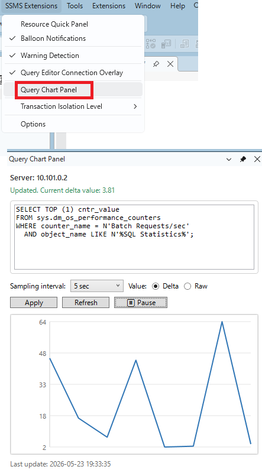